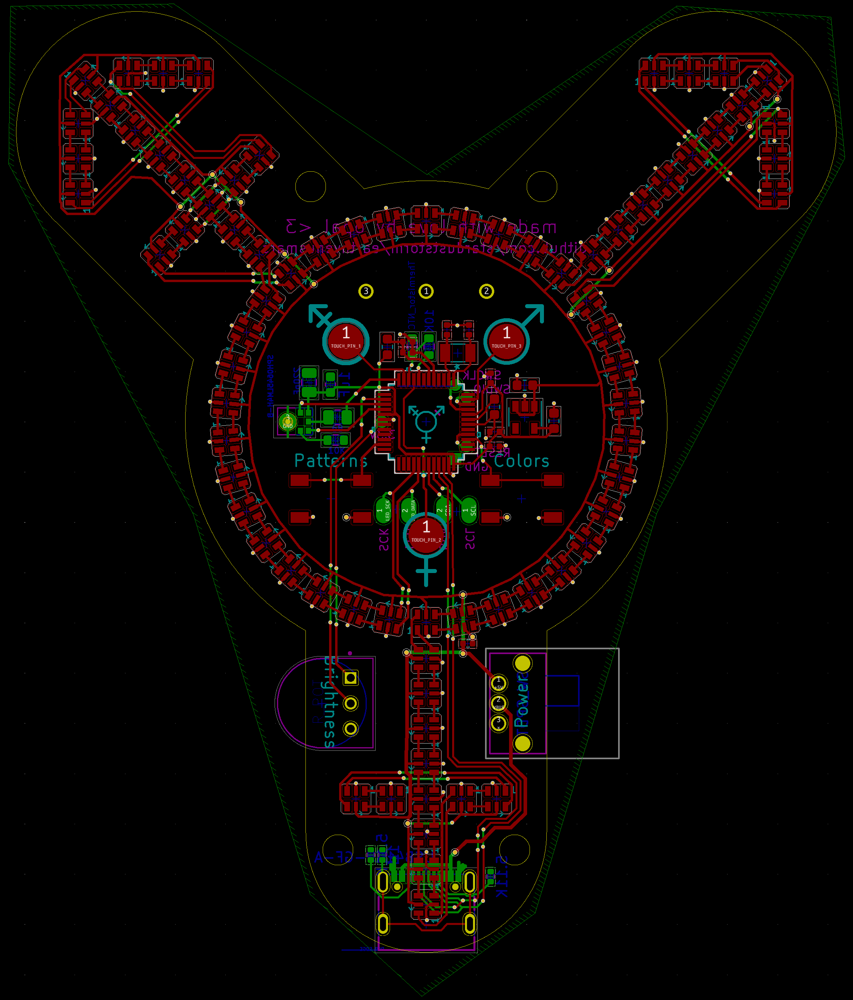
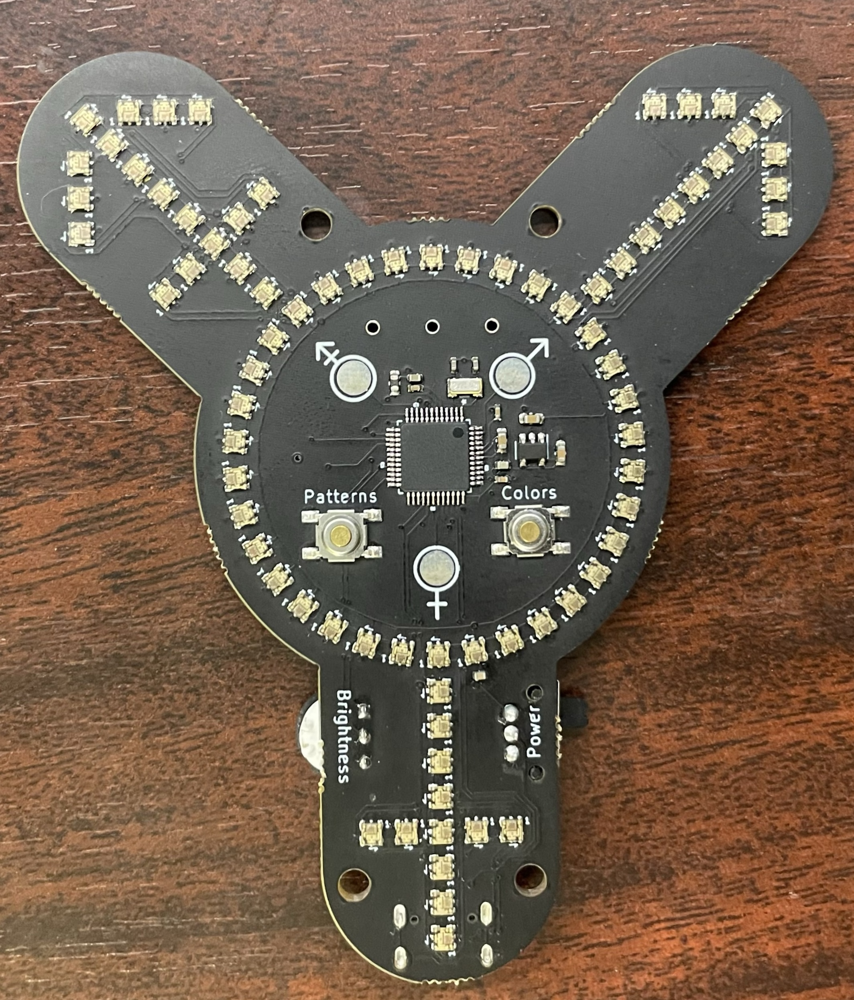

# Earth Venus Mars
##### *if men are from mars and women are from venus then does that mean enbies are from earth 🧐*

## A Wearable LED Transgender Symbol
##### *because I wanted this to exist*
#
## Hardware

* LEDs: APA102c-2020, very tiny & very bright
* PCB: Designed with KiCad, design files are in ./board
* Chip: SAMD21G18a, 32-bit ARM

<!--  -->

&nbsp;

### Features: 
* 78 blindingly-bright LEDs
* Three capacitive touch pads designed into the aesthetic interactivity/customizability
* Two SPST buttons for selecting patterns & colors
* Onboard I2S microphone for sound responsiveness
* Onboard thermistor for temperature management
* Brightness dial to manage level of eye-lasering
* Power switch for longer storage
* Micro-USB for power & hacking, requires 5v input from wall or battery
* SWD pads for low-level hacking
* Exposed (but unused) I2C pads and SPI pads for you to hack with as you please
* Mount points for bar pin or other attachment

#
## Software

Arduino-compatible, C++ code built to run against the Arduino Zero bootloader & stack on a SAMD21g mcu.

### Features

* LED patterns custom-designed for this pixel layout
* Sound patterns responsive to volume & pitch
* Touch responsiveness for playing with the venus, mars, and 'earth' iconography
* Power management built in to brightness dial - turn the dial down to put the device to sleep
* Automatic thermal management scales down max brightness since the LEDs get very hot when at higher brightnesses
* Paletting system for a variety of pride flags
* Modes for automatic palette & pattern rotation

### Code

The project is built with arm-none-eabi-g++ using [PlatformIO] in Visual Studio Code.

### Libraries & Dependencies

* [FastLED]
* [Adafruit Zero FFT]
* [Adafruit Zero I2S]
* [Adafruit FreeTouch]

### Build Environments

There are two build environments, v1 & v2, referencing the hardware version of the pcb. Deployments of top-of-tree code should always use the highest build environment (v2).

### Buttons

* Colors
  - Single press - Next Palette
  - Double Press - Previous Palette
  - Long Press - Palette Rotation

* Patterns
  - Single Press - Next Pattern
  - Double Press - Previous Pattern
  - Long Press - Pattern Rotation

### Power

The board is designed to be portable & wearable and will run off of just about any USB battery pack. However, when running a fully-lit pattern at maximum brightness, the leds will draw upwards of 12W, making short work of pocket-sized batteries. Therefore it is recommended to set brightness well below the maximum for extended use, choose a pattern that does not light all the leds simultaneously, or expect to need a larger battery.

When the brightness dial is turned all the way down, the device will enter sleep mode. This draws much less power than when it is running, but it will still slowly drain batteries in this mode. 

### Temperature

When the LEDs are lit near maximum brightness they dissipate a lot of heat. Software will automatically begin scaling maximum brightness down when a temperature sensor reads around 45°C, but parts of the board may still become too hot to touch. 

## Third party thanks

This project would not have been possible without the incredible open-source work by the fine folks at [FastLED], which drives SPI for the LEDs in this project and provides lots of efficient 8- and 16-bit math & palette routines, and is a joy to work with.

Similarly many of the advanced features of this project are only possible due to the open-source work at the relentlessly-brilliant [Adafruit], including SAMD support for the I2S peripheral, a high-level FFT library for sound responsiveness, and an abstraction of all the complexities of QTouch with the FreeTouch library. On top of that there's adalink for bootloader programming & lots of help in Adafruit's guides on everything from bootloaders to thermistors.

And of course the venerable [Arduino] for creating such a widespread hackable platform to begin with.

Thank you for all the work you do for makers & hobbyists the world over.

<!-- github no likey video tag -->
<!-- <video height="646" src="doc/assets/seven.mp4" type="video/mp4" loop autoplay /> -->

[Arduino]: <https://arduino.cc>
[Adafruit]: <https://www.adafruit.com>
[FastLED]: https://github.com/FastLED/FastLED
[Adafruit Zero FFT]: <https://github.com/adafruit/Adafruit_ZeroFFT>
[Adafruit Zero I2S]: <https://github.com/adafruit/Adafruit_ZeroI2S>
[Adafruit FreeTouch]: <https://github.com/adafruit/Adafruit_FreeTouch>
[PlatformIO]: <https://platformio.org>

