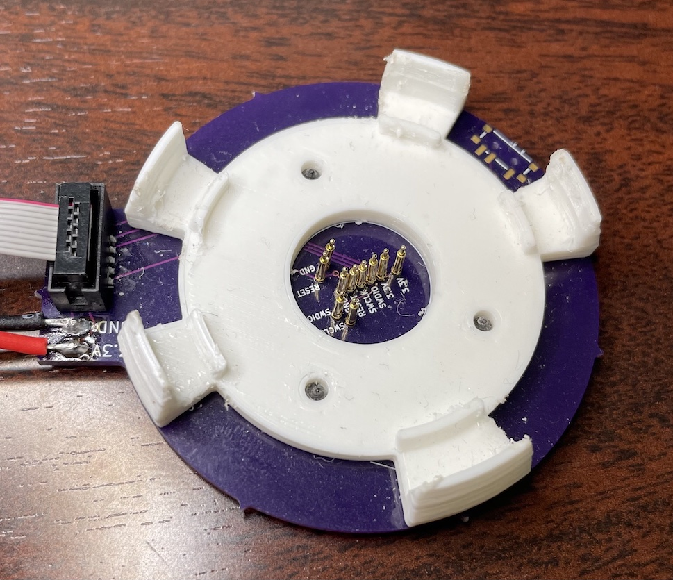

# Programmer Rig

Bootloader-programming rig matched to the main PCB board shape allows SWD programming & debugging. Pogo-pins on the programming board contact SWD pins on the main board while a 3D-printed part holds the board in place.

This rig & these instructions are only necessary for reflashing the bootloader on the samd21g in case of assembling a board from scratch. An already-programmed device will appear as an Arduino Zero over USB for loading regular code.

## Making the Programmer Rig

#### Parts
* 3D-printed caddy.stl
* [Pogo pins] (part# 0985-1-15-20-71-14-11-0)
* [SWD Connector] (part# 3221-10-0300-00)
* M3.5 screws
* Programmer device such as the [Black Magic Probe] or the (non-commercial) [ATMEL J-Link Edu Mini]
* 10-pin SWD cable

#### Assembly

1. Assemble the programmer by soldering the pogo pins & SWD connector as shown. Note that only 5 pogo pins are needed, the inner 5 pins in a line labeled 3.3V thru GND are legacy for an old version of the PCB and are optional. 
2. Screw on the 3D-printed caddy as shown
3. Solder wires for 3.3v power source



An assembled EVM board should slot into the programmer rig & make contact with the pogo pins.

#
## Programming Instructions

1. Download and build a copy of the Arduino Zero bootloader from [ArduinoCore-samd]
2. Assemble a programmer rig
3. Attach board to programmer rig
4. Apply 3.3v to power pins on programmer rig

### Programming with Black Magic Probe

5. Install gdb via your preferred toolset, e.g.
```sh
brew install gcc-arm-embedded
```
or e.g.
```sh 
sudo add-apt-repository ppa:team-gcc-arm-embedded/ppa
sudo apt install gcc-arm-embedded
```

6. Attach BlackMagic Probe to computer and note the device with dmesg or preferred tool. It may be /dev/ttyACM0 on linux, or /dev/cu.usbmodemXXXXXXXXX on mac.
7. Edit ./scripts/config with your gdb, BlackMagic Probe, and built-bootloader paths.
8. Run ./scripts/gdb-flash.sh

### Programming with J-Link on mac/linux
5. Install [adalink]
6. Run

```sh
$ adalink -v atsamd21g18 -p jlink -w -h path/to/ArduinoCore-samd/bootloaders/zero/samd21_sam_ba.hex
```

### Programming on Windows
* Use ATMEL's first party tools to flash & program the device; I don't use Windows


[Black Magic Probe]: <https://1bitsquared.com/products/black-magic-probe>
[Pogo pins]: <https://www.digikey.com/en/products/detail/mill-max-manufacturing-corp/0985-1-15-20-71-14-11-0/5823029>
[SWD Connector]: <https://www.digikey.com/en/products/detail/cnc-tech/3221-10-0300-00/4878946>
[adalink]: <https://github.com/adafruit/Adafruit_Adalink>
[ArduinoCore-samd]: <https://github.com/arduino/ArduinoCore-samd>
[ATMEL J-Link Edu Mini]: <https://www.segger.com/products/debug-probes/j-link/models/j-link-edu-mini/>
